# 🏥 Med Predictor Platform - UML Diagrams

## Comprehensive UML Documentation for All Workflows

---

## 📋 **UML Diagram Overview**

This document contains comprehensive UML diagrams for the Med Predictor platform, covering:

-   **Class Diagrams** - System architecture and relationships
-   **Sequence Diagrams** - User interaction workflows
-   **Activity Diagrams** - Process flows and decision points
-   **State Diagrams** - Entity lifecycle management

---

## 🏗️ **Class Diagrams**

### **1. Core System Architecture**

```mermaid
classDiagram
    class User {
        +id: int
        +name: string
        +email: string
        +role: string
        +entity_type: string
        +club_id: int
        +association_id: int
        +fifa_connect_id: string
        +permissions: json
        +status: string
        +created_at: timestamp
        +updated_at: timestamp
        +generateFifaConnectId()
        +hasPermission()
        +getEntity()
    }

    class Player {
        +id: int
        +name: string
        +first_name: string
        +last_name: string
        +date_of_birth: date
        +nationality: string
        +position: string
        +height: int
        +weight: int
        +fifa_connect_id: string
        +overall_rating: int
        +potential_rating: int
        +value_eur: int
        +wage_eur: int
        +club_id: int
        +association_id: int
        +player_picture: string
        +medical_clearance_status: string
        +created_at: timestamp
        +updated_at: timestamp
        +getAge()
        +getFullName()
        +isEligibleForCompetition()
        +getPerformanceStats()
    }

    class Club {
        +id: int
        +name: string
        +fifa_connect_id: string
        +fifa_id: string
        +association_id: int
        +logo_url: string
        +website: string
        +email: string
        +phone: string
        +address: string
        +status: string
        +created_at: timestamp
        +updated_at: timestamp
        +getPlayers()
        +getTeams()
        +getLicenses()
    }

    class Association {
        +id: int
        +name: string
        +fifa_connect_id: string
        +logo_url: string
        +website: string
        +email: string
        +phone: string
        +address: string
        +country: string
        +status: string
        +created_at: timestamp
        +updated_at: timestamp
        +getClubs()
        +getCompetitions()
        +getUsers()
    }

    class Competition {
        +id: int
        +name: string
        +type: string
        +association_id: int
        +start_date: date
        +end_date: date
        +registration_deadline: date
        +max_teams: int
        +fifa_compliance_required: boolean
        +rules: text
        +status: string
        +created_at: timestamp
        +updated_at: timestamp
        +generateSchedule()
        +calculateStandings()
        +getTeams()
    }

    class Team {
        +id: int
        +name: string
        +club_id: int
        +competition_id: int
        +formation: string
        +status: string
        +created_at: timestamp
        +updated_at: timestamp
        +getPlayers()
        +getMatches()
        +getStats()
    }

    class Match {
        +id: int
        +competition_id: int
        +home_team_id: int
        +away_team_id: int
        +match_date: datetime
        +venue: string
        +status: string
        +home_score: int
        +away_score: int
        +matchday: int
        +created_at: timestamp
        +updated_at: timestamp
        +getEvents()
        +getLineups()
        +getMatchSheet()
    }

    class MatchEvent {
        +id: int
        +match_id: int
        +event_type: string
        +minute: int
        +player_id: int
        +team_id: int
        +details: json
        +logged_by: int
        +created_at: timestamp
        +updated_at: timestamp
        +getPlayer()
        +getTeam()
    }

    class PlayerLicense {
        +id: int
        +player_id: int
        +club_id: int
        +competition_id: int
        +license_type: string
        +status: string
        +medical_clearance: boolean
        +submitted_by: int
        +approved_by: int
        +submitted_at: timestamp
        +approved_at: timestamp
        +expires_at: timestamp
        +created_at: timestamp
        +updated_at: timestamp
        +isValid()
        +isExpired()
    }

    class HealthRecord {
        +id: int
        +player_id: int
        +record_type: string
        +record_date: date
        +description: text
        +doctor_id: int
        +file_path: string
        +status: string
        +created_at: timestamp
        +updated_at: timestamp
        +getPlayer()
        +getDoctor()
    }

    class MedicalPrediction {
        +id: int
        +player_id: int
        +prediction_type: string
        +risk_level: string
        +confidence_score: float
        +factors: json
        +recommendations: text
        +created_at: timestamp
        +updated_at: timestamp
        +getPlayer()
        +isHighRisk()
    }

    %% Relationships
    User ||--o{ Player : manages
    User ||--o{ Club : administers
    User ||--o{ Association : administers

    Association ||--o{ Club : contains
    Association ||--o{ Competition : organizes
    Association ||--o{ User : has_users

    Club ||--o{ Player : has_players
    Club ||--o{ Team : has_teams
    Club ||--o{ PlayerLicense : manages_licenses

    Competition ||--o{ Team : has_teams
    Competition ||--o{ Match : has_matches
    Competition ||--o{ PlayerLicense : requires_licenses

    Team ||--o{ Player : has_players
    Team ||--o{ Match : plays_in

    Match ||--o{ MatchEvent : has_events
    Match ||--o{ Team : involves_teams

    Player ||--o{ PlayerLicense : has_licenses
    Player ||--o{ HealthRecord : has_records
    Player ||--o{ MedicalPrediction : has_predictions
    Player ||--o{ MatchEvent : participates_in
```

### **2. FIFA Connect Integration Classes**

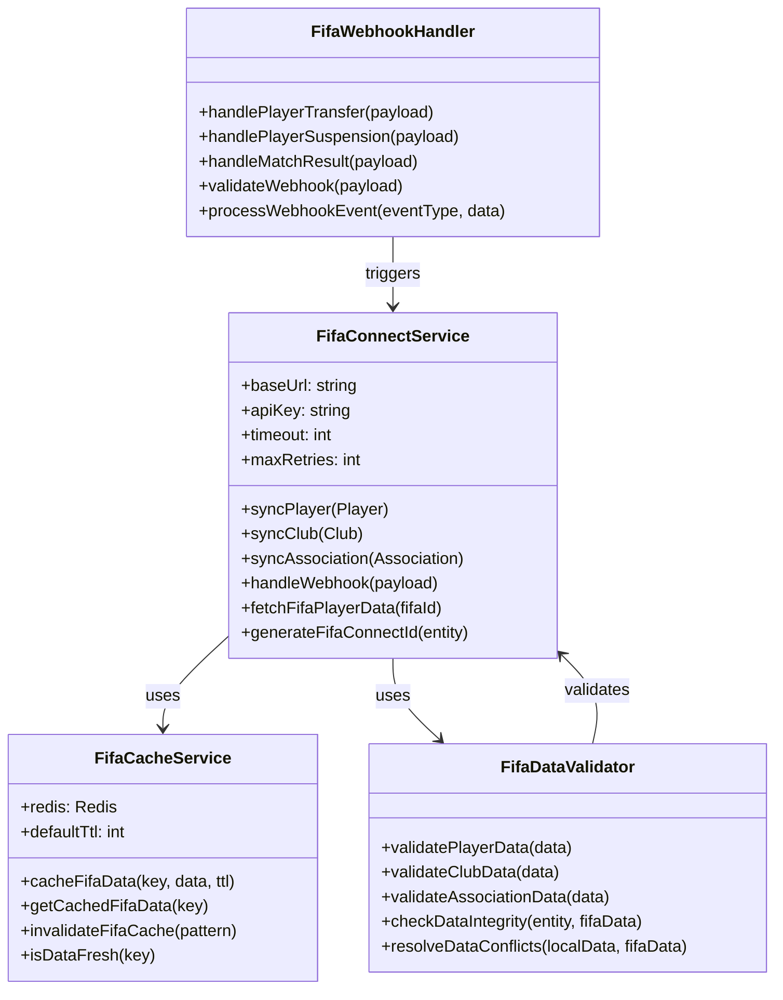

---

## 🔄 **Sequence Diagrams**

### **1. Association Administrator - Club Registration Workflow**

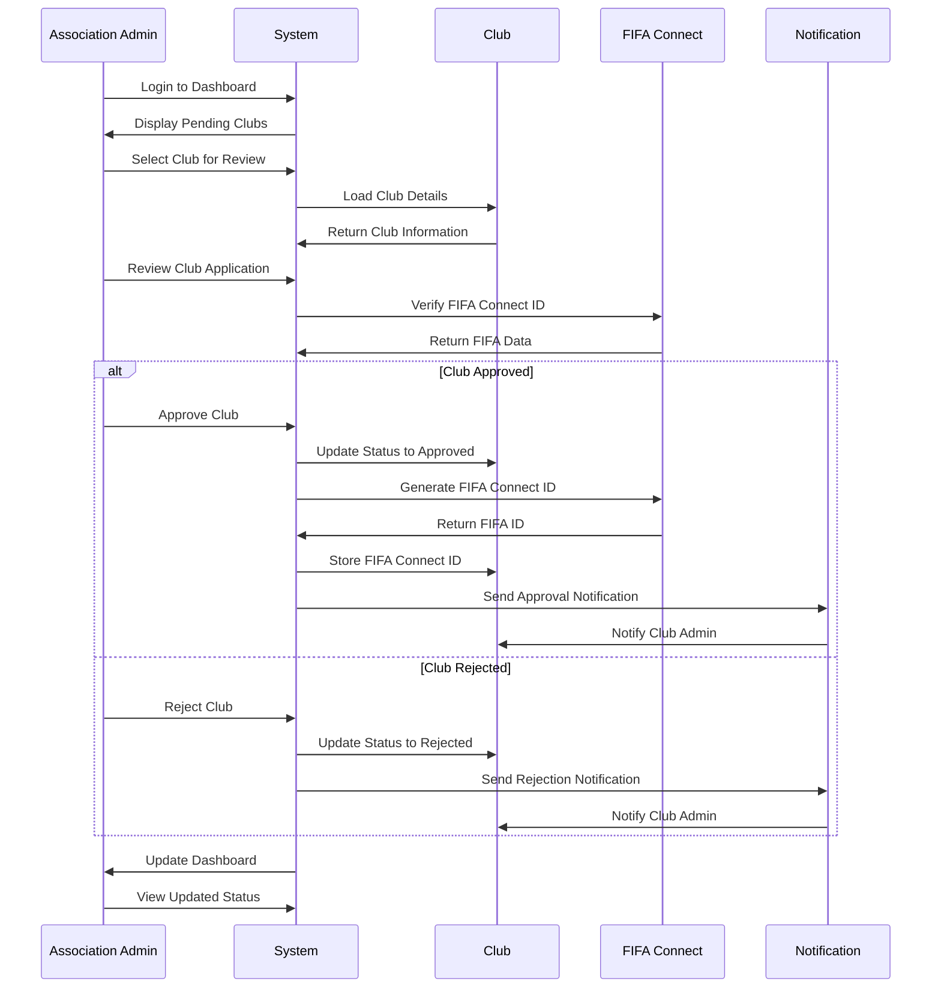

### **2. Club Administrator - Player Registration Workflow**

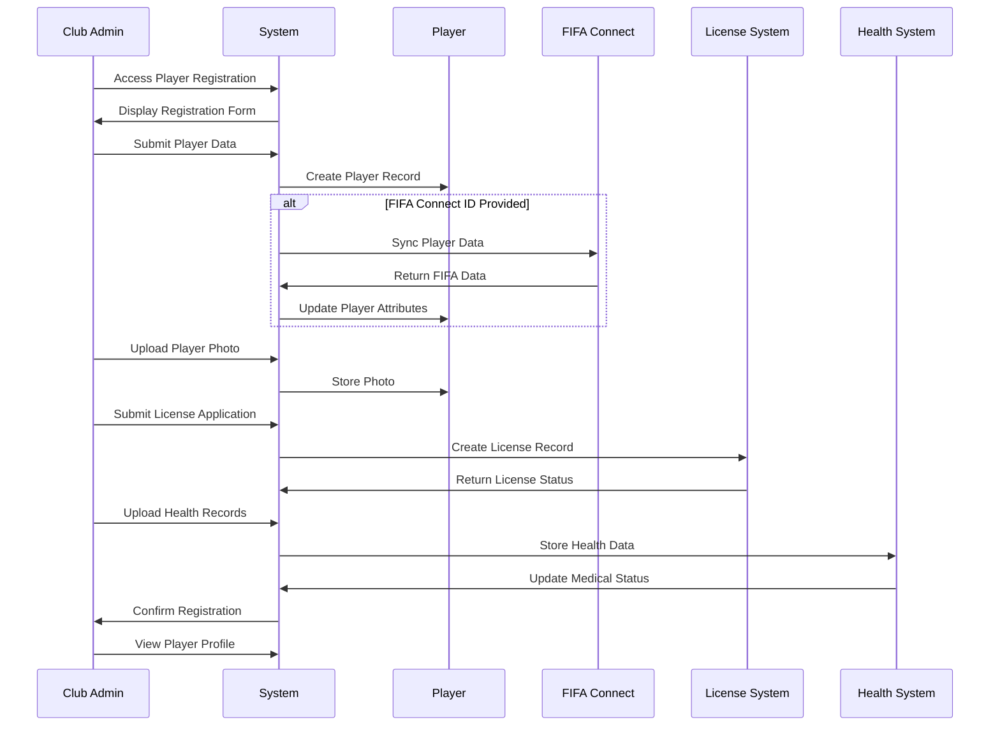

### **3. Player Self-Service - Profile Management Workflow**

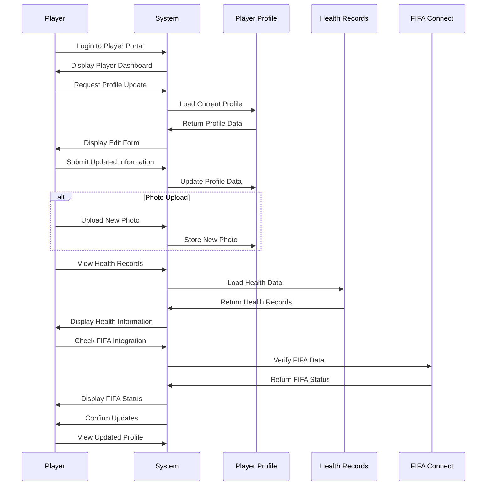

### **4. Competition Management Workflow**

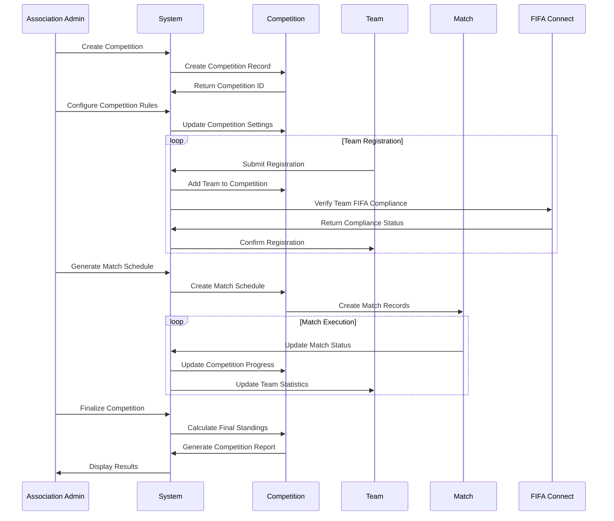

---

## 📊 **Activity Diagrams**

### **1. Player Registration Process**

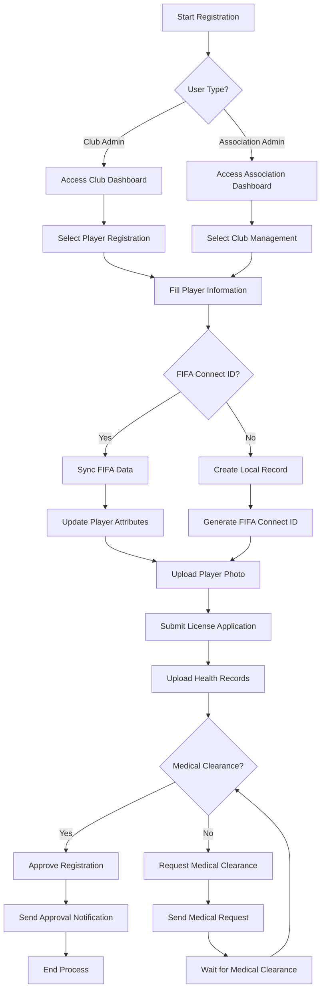

### **2. Competition Management Process**

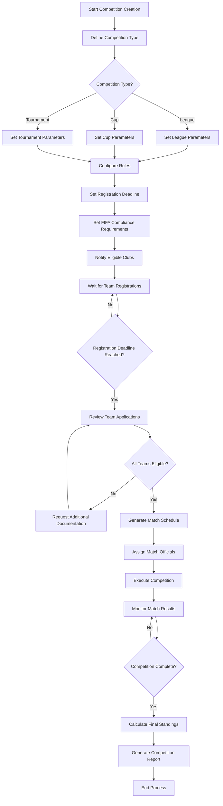

### **3. License Management Process**

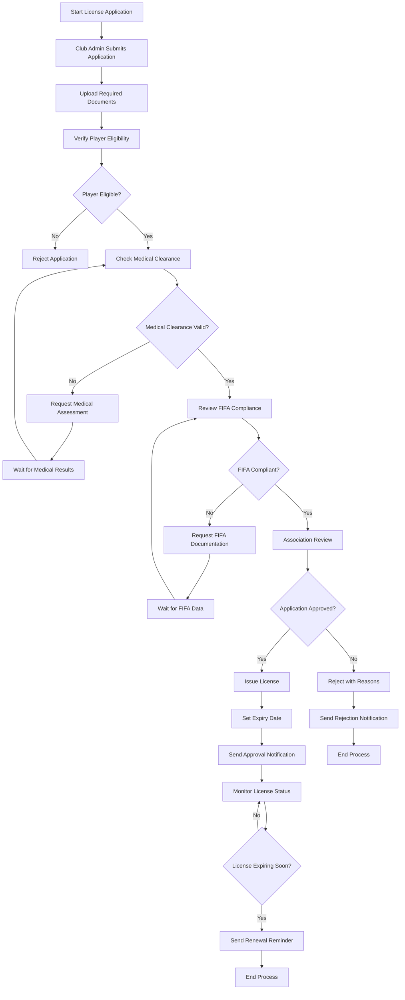

---

## 🔄 **State Diagrams**

### **1. Player Lifecycle States**

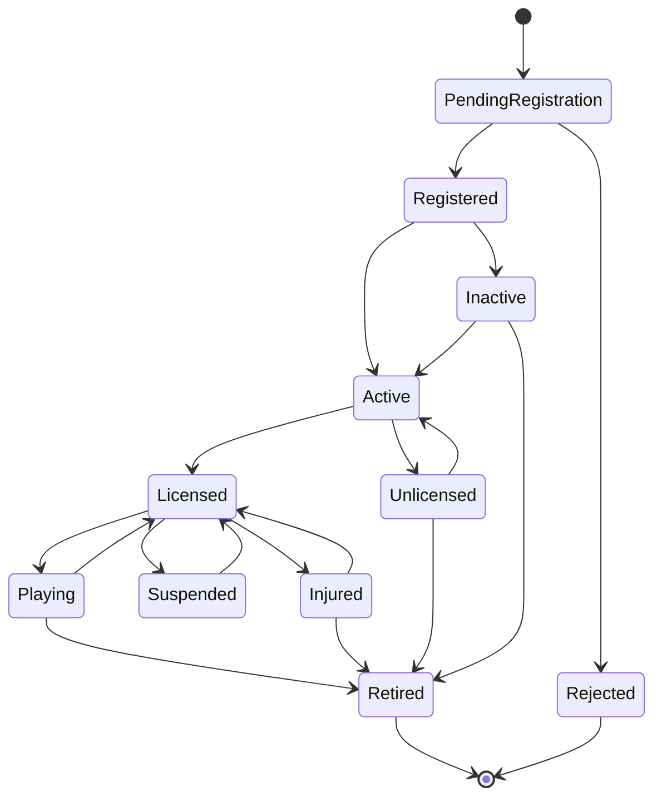

### **2. Competition States**

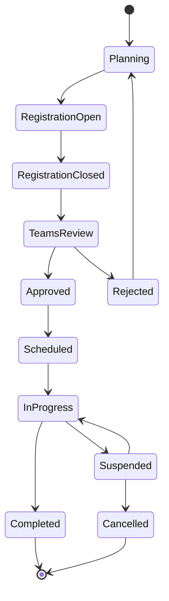

### **3. License States**

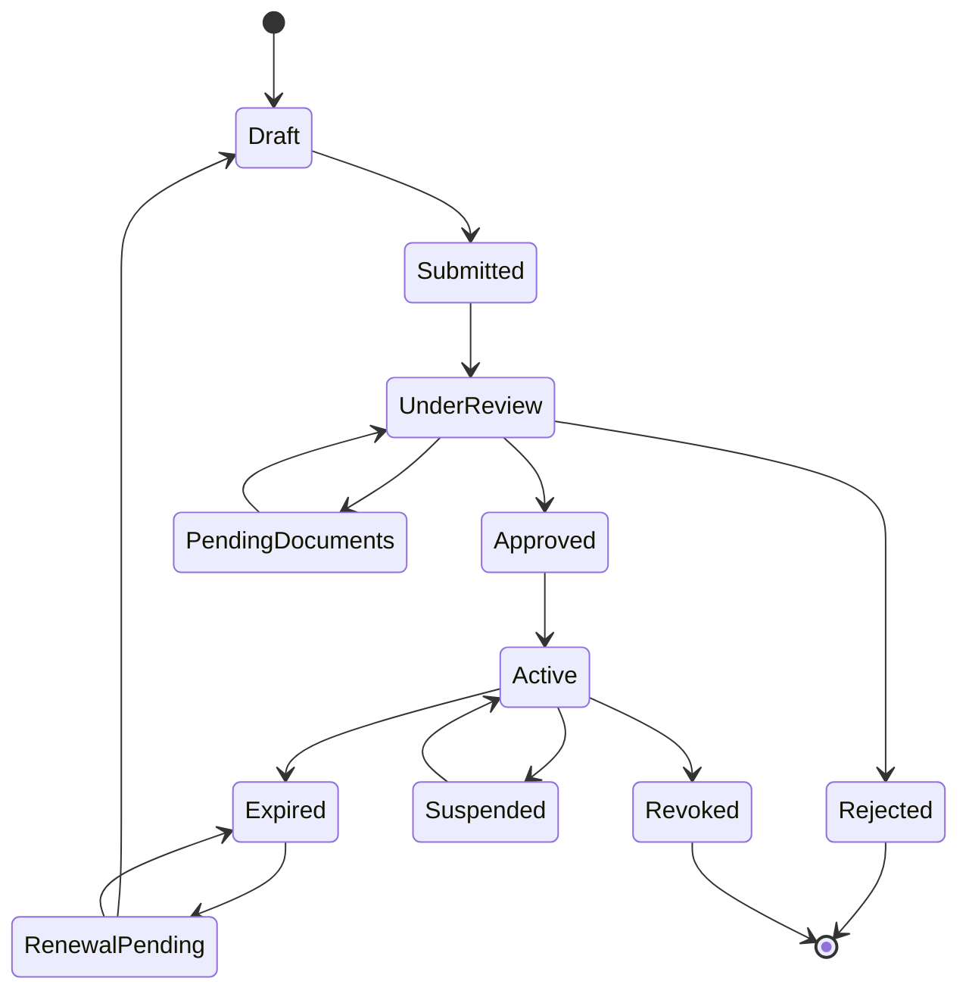

---

## 🏗️ **Component Diagrams**

### **1. System Architecture Components**

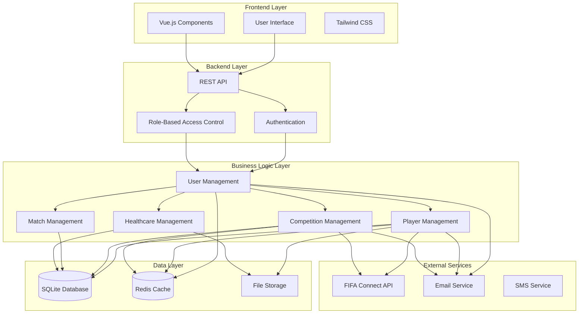

### **2. FIFA Integration Components**

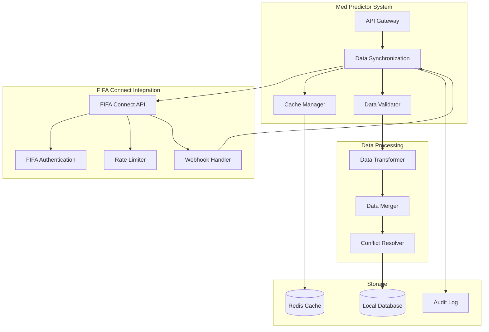

---

## 📊 **Deployment Diagram**

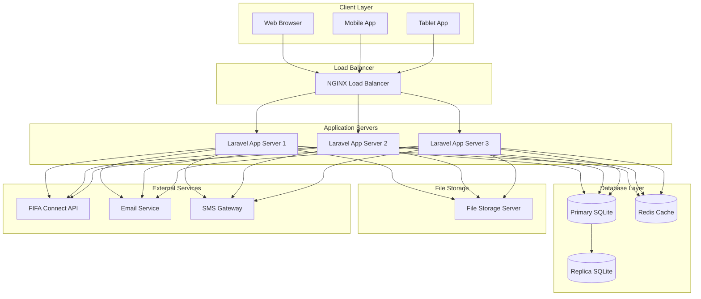

---

## 🎯 **UML Diagram Summary**

### **📋 Diagram Types Created**

1. **Class Diagrams** - System architecture and relationships
2. **Sequence Diagrams** - User interaction workflows
3. **Activity Diagrams** - Process flows and decision points
4. **State Diagrams** - Entity lifecycle management
5. **Component Diagrams** - System architecture components
6. **Deployment Diagram** - Infrastructure and deployment

### **🔧 Key Workflows Documented**

-   **Association Administrator Workflows**
-   **Club Administrator Workflows**
-   **Player Self-Service Workflows**
-   **Competition Management Workflows**
-   **License Management Workflows**
-   **FIFA Connect Integration Workflows**

### **📊 Technical Architecture**

-   **Frontend**: Vue.js, Tailwind CSS, Alpine.js
-   **Backend**: Laravel 11.x, PHP 8.2+
-   **Database**: SQLite with Eloquent ORM
-   **Caching**: Redis for performance optimization
-   **External APIs**: FIFA Connect integration
-   **Security**: Role-based access control (RBAC)

### **🚀 Benefits of UML Documentation**

1. **Clear System Understanding** - Visual representation of complex workflows
2. **Development Guidance** - Detailed technical specifications
3. **Stakeholder Communication** - Easy-to-understand diagrams
4. **Maintenance Support** - Clear system architecture documentation
5. **Scalability Planning** - Component and deployment architecture

---

_Med Predictor - Comprehensive UML Documentation for Modern Football Management_
